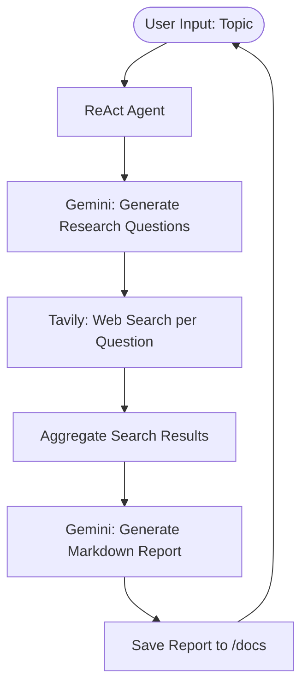

# 🕵️‍♂️ Web Research Agent — ReAct Pattern

[](https://github.com/SANJAI-s0/Web_Research_Agent_using-ReAct/blob/main/LICENSE)
[](https://www.python.org/downloads/)
[](https://deepmind.google/technologies/gemini/)
[](https://tavily.com/)
[](https://github.com/SANJAI-s0/Web_Research_Agent_using-ReAct)
[](https://github.com/SANJAI-s0/Web_Research_Agent_using-ReAct/commits/main)

A powerful autonomous Web Research Agent built using the **ReAct (Reasoning + Acting)** design pattern. This agent leverages the reasoning capabilities of **Google Gemini 2.5 Flash** to plan its research and the extraction power of **Tavily Search API** to gather real-time web intelligence.

---

## 📖 Table of Contents

- [Overview](#-overview)
- [How It Works (ReAct Pattern)](#-how-it-works-react-pattern)
- [Workflow Architecture](#-workflow-architecture)
- [Key Features](#-key-features)
- [Tech Stack](#-tech-stack)
- [Project Structure](#-project-structure)
- [Installation & Setup](#-installation--setup)
- [Usage Guide](#-usage-guide)
- [Environment Variables](#-environment-variables)
- [License](#-license)

---

## 🌟 Overview

The **Web Research Agent** transforms a simple topic into a comprehensive, structured research report. Unlike traditional search engines, this agent "thinks" about the topic first, identifies the most relevant questions to ask, searches the web programmatically, and then synthesizes the findings into a professional Markdown document.

---

## 🧠 How It Works (ReAct Pattern)

This project implements a streamlined version of the ReAct pattern:

1.  **Reasoning (Plan):** The agent uses Gemini 2.5 Flash to decompose a broad research topic into 5-6 diverse and strategic research questions.
2.  **Acting (Search):** For each question, the agent "acts" by querying the Tavily Search API to retrieve high-quality, relevant web snippets.
3.  **Synthesis (Observe & Report):** The agent aggregates all search results and uses its reasoning capabilities to format a final, structured Markdown report.

---

## 🏗️ Workflow Architecture

The following diagram illustrates the agent's internal process:



---

## 🛠️ Key Features

- **🎯 Intelligent Questioning:** Automatically generates 5–6 research questions covering different dimensions of a topic.
- **🌐 Real-Time Intelligence:** Uses Tavily Search for high-accuracy, recent web data (optimized for LLMs).
- **📄 Structured Markdown Output:** Produces professional reports with an introduction, key findings per question, and a conclusion.
- **⚙️ Automated Pipeline:** Zero manual intervention required from topic entry to file saving.
- **🧠 Advanced Reasoning:** Powered by Gemini 2.5 Flash for high-speed, reliable JSON-based planning.

---

## 💻 Tech Stack

- **LLM Engine:** [Google Gemini 2.5 Flash](https://aistudio.google.com/)
- **Search Engine API:** [Tavily AI](https://tavily.com/)
- **Programming Language:** Python 3.9+
- **Configuration:** `python-dotenv` for secure environment management

---

## 📂 Project Structure

```bash
ReAct/
├── Flow/                  # Workflow diagrams (.mmd)
│   └── workflow.mmd
├── docs/                  # Generated research reports (.md)
│   └── research_report_tavily_gemini.md
├── .env                   # Private API keys
├── .env.example           # Shared environment template
├── .gitignore             # Standard git exclusions
├── LICENSE                # MIT License
├── ReAct.py               # Core Agent implementation
├── README.md              # Project documentation
└── requirements.txt       # Dependency list
```

---

## ⚙️ Installation & Setup

### 1. Clone the Repository
```bash
git clone https://github.com/SANJAI-s0/Web_Research_Agent_using-ReAct.git
cd Web_Research_Agent_using-ReAct
```

### 2. Prepare Environment
```bash
# Create and activate virtual environment
python -m venv venv
source venv/bin/activate  # On Windows: venv\Scripts\activate

# Install requirements
pip install -r requirements.txt
```

### 3. Configure API Keys
1. Get a **Gemini API Key** from [Google AI Studio](https://aistudio.google.com/).
2. Get a **Tavily API Key** from [Tavily AI](https://app.tavily.com).
3. Create your `.env` file:
   ```bash
   cp .env.example .env
   ```
4. Update the keys in `.env`:
   ```env
   GEMINI_API_KEY=your_gemini_key
   TAVILY_API_KEY=your_tavily_key
   ```

---

## 🚀 Usage Guide

Launch the agent:
```bash
python ReAct.py
```

### Sample Workflow:
1. **Input:** "The future of fusion energy by 2050"
2. **Process:** Agent generates questions → Searches Tavily → Aggregates data.
3. **Output:** A structured file in `docs/research_report_tavily_gemini.md`.

---

## 🔑 Environment Variables

| Variable | Required | Description |
|---|---|---|
| `GEMINI_API_KEY` | **Yes** | Google Gemini API Key |
| `TAVILY_API_KEY` | **Yes** | Tavily Search API Key |

---

## 📜 License

Distributed under the MIT License. See [LICENSE](LICENSE) for more information.

---

<p align="center">
  Built with 🕵️‍♂️ by <a href="https://github.com/SANJAI-s0">Sanjai S0</a>
</p>
